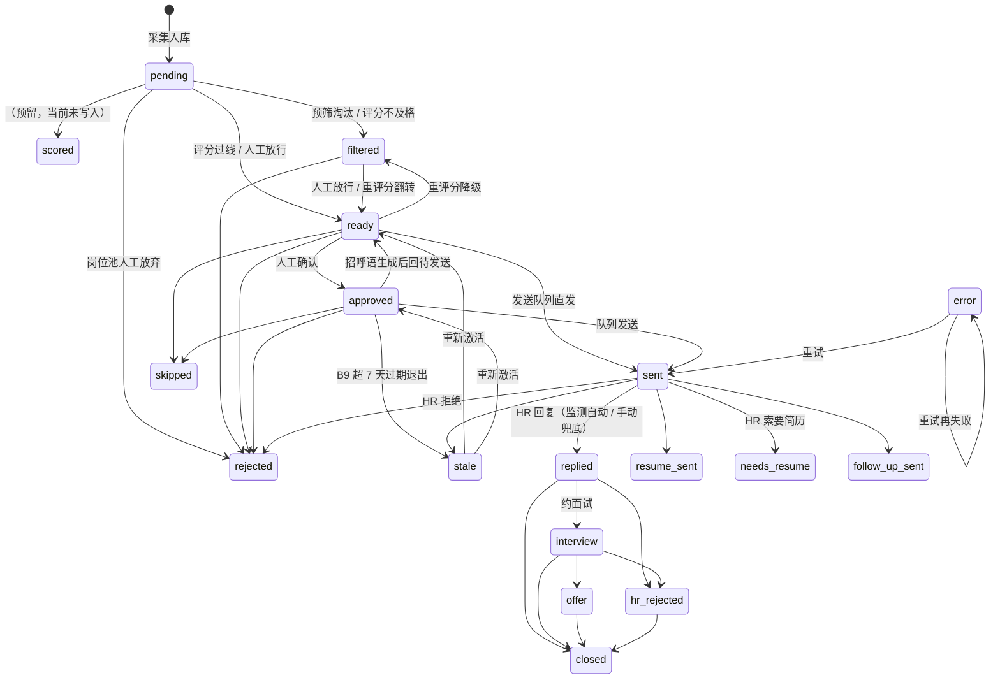

# 岗位状态机（A2）

> 权威定义在 `src/openjob/contracts.py::JOB_STATUS_TRANSITIONS`；本文是可视化文档。
> 非法迁移返回 409 `ILLEGAL_STATUS_TRANSITION` 并保留原状态；同状态幂等重写始终允许。

## 投后终态（A2 新增）

| 状态 | 含义 | 进入方式 | 出口 |
| --- | --- | --- | --- |
| `interview` | 面试中 | `POST /api/jobs/<id>/transition`（首次进入自动记录 `interview_at`） | offer / hr_rejected / closed |
| `offer` | 拿到 Offer | 同上 | closed |
| `hr_rejected` | HR 明确拒绝 | 监测识别或手动流转 | closed |
| `closed` | 流程关闭（含关闭原因 `closed_at`/`closed_reason`） | 同上，可带 reason | 终态 |
| `stale` | 审批后超 7 天未发送（B9） | `POST /api/jobs/stale-exit` 批量或详情页重新激活 | ready / approved |

## 回复回流（A1）

- 监测扫描到 HR 回复 → 指纹去重后 `record_job_reply`（首响时间 `replied_at`、计数
  `reply_count`、≤60 字摘要 `last_reply_snippet`）+ `sent → replied`；
- 未匹配/歧义会话不再丢弃 → `conversations` 表（指纹唯一），回复工作台人工关联；
- 手动兜底：`POST /api/jobs/<id>/mark-replied`；
- 聊天正文不入库（隐私存量最小化），只存摘要与结构化字段。

## 回复工作台（A3）

- `GET /api/inbox`：待处理会话（含未匹配待关联）+ 待确认回复计数；
- 草稿：`POST /api/conversations/<id>/draft` 只生成文本、只进剪贴板，**零发送副作用**；
  生成走 S1 事实校验（未过校验明确标注），HR 消息按不可信文本做注入中性化；
- 关联/处置：`/link` `/resolve` `/dismiss`（仅 pending 会话可关联）。
